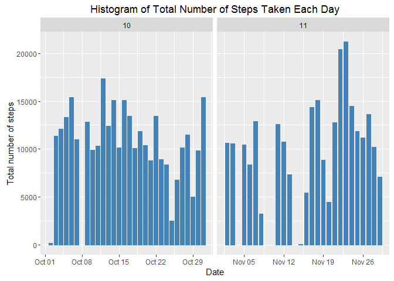
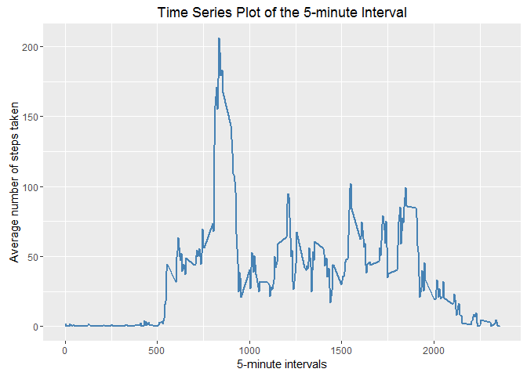
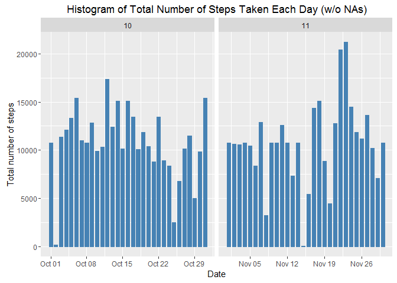
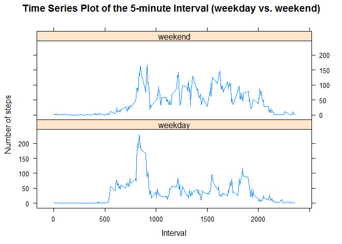

## Reproducible Research Assignment 1 - Activity Analysis
Created by Georgios N. Efthimiou
October 16, 2016

This file was created for the purposes of the 1st Assignment of the Reproducible Research Course. Below, you can find my answers to the assignment's questions.

### Global Options


```r
knitr::opts_chunk$set(echo = TRUE) #in order to show code chunks on generated output
keep_md = TRUE
options(scipen = 1, digits = 2) #in order to disable the scientific notation of numbers
Sys.setlocale("LC_ALL", "English")
Sys.setenv(LANG = "en_US.UTF-8") #in oder to turn dates in plots into English
```

### Loading and preprocessing the data


```r
unzip("./activity.zip")
data <- read.csv("activity.csv", colClasses = c("integer", "Date", "factor"))
data$month <- as.numeric(format(data$date, "%m"))
nonNA <- na.omit(data)
rownames(nonNA) <- 1:nrow(nonNA)
library(ggplot2)
```

### What is mean total number of sterps taken per day?

The following histogram shows the total number of steps taken each day.


```r
ggplot(nonNA, aes(date, steps)) + geom_bar(stat = "identity", colour = "steelblue", fill = "steelblue", width = 0.7) + facet_grid(. ~ month, scales = "free") + labs(title = "Histogram of Total Number of Steps Taken Each Day", x = "Date", y = "Total number of steps")
```

<!-- -->

For the calculation of the mean and the median of the total number of steps taken per day, we have the following code chunk:


```r
totalSteps <- aggregate(nonNA$steps, list(Date = nonNA$date), FUN = "sum")$x
stepsMean <- mean(totalSteps)
stepsMedian <- median(totalSteps)
```

The mean of total number of steps taken per day is 10766.19 and the median is 10765.

### What is the average daily activity pattern?

The following time-series plot shows the 5-minute interval and the average number of steps taken, averaged across all days. 


```r
averageSteps <- aggregate(nonNA$steps, list(interval = as.numeric(as.character(nonNA$interval))), FUN = "mean")
names(averageSteps)[2] <- "meanOfSteps"
ggplot(averageSteps, aes(interval, meanOfSteps)) + geom_line(color = "steelblue", size = 0.8) + labs(title = "Time Series Plot of the 5-minute Interval", x = "5-minute intervals", y = "Average number of steps taken")
```

<!-- -->

For the calculation of the interval containing the maximum number of steps, we have the following code chunk:


```r
maxAverageSteps <- max(averageSteps$meanOfSteps)
maxInterval <- subset(averageSteps$interval, averageSteps$meanOfSteps == maxAverageSteps)
```

The maximum number of steps in contained in the 835th interval.

### Imputing missing values

For the calculation of the total number of missing values, we have the following code chunk:


```r
sumNA <- sum(is.na(data))
```

The total number of missing values (i.e. NA) is 2304.

In order to fill in all the missing values in the data set, we choose to use the mean of the 5-minute interval.


```r
newData <- data 
for (i in 1:nrow(newData)) {
    if (is.na(newData$steps[i])) {
        newData$steps[i] <- averageSteps[which(newData$interval[i] == averageSteps$interval), ]$meanOfSteps
    }
}
```

The following histogram shows the total number of steps taken each day after the replacement of the NAs.


```r
ggplot(newData, aes(date, steps)) + geom_bar(stat = "identity", colour = "steelblue", fill = "steelblue", width = 0.7) + facet_grid(. ~ month, scales = "free") + labs(title = "Histogram of Total Number of Steps Taken Each Day (w/o NAs)", x = "Date", y = "Total number of steps")
```

<!-- -->

For the calculation of the new mean and the new median of the total number of steps taken per day, we have the following code chunk:


```r
newTotalSteps <- aggregate(newData$steps, list(Date = newData$date), FUN = "sum")$x
newStepsMean <- mean(newTotalSteps)
newStepsMedian <- median(newTotalSteps)
```

The new mean of total number of steps taken per day is 10766.19 and the new median is 10766.19.

As we observe, the new mean is equal to the old one but the new median is greater than the old one.

### Are there differences in activity patterns between weekdays and the weekends?

For the creation the new factor variable (weekday vs. weekend), we have the following code chunk:


```r
newData$weekdays <- factor(format(newData$date, "%A"))
levels(newData$weekdays) <- list(weekday = c("Monday", "Tuesday", "Wednesday", "Thursday", "Friday"), weekend = c("Saturday", "Sunday"))
```

The following time-series plot shows the 5-minute interval and the average number of steps taken, averaged across all weekdays or weekedn days. 


```r
averageSteps <- aggregate(newData$steps, list(interval = as.numeric(as.character(newData$interval)), weekdays = newData$weekdays),FUN = "mean")
names(averageSteps)[3] <- "meanOfSteps"
library(lattice)
xyplot(averageSteps$meanOfSteps ~ averageSteps$interval | averageSteps$weekdays, layout = c(1, 2), type = "l", main = "Time Series Plot of the 5-minute Interval (weekday vs. weekend)", xlab = "Interval", ylab = "Number of steps")
```

<!-- -->
